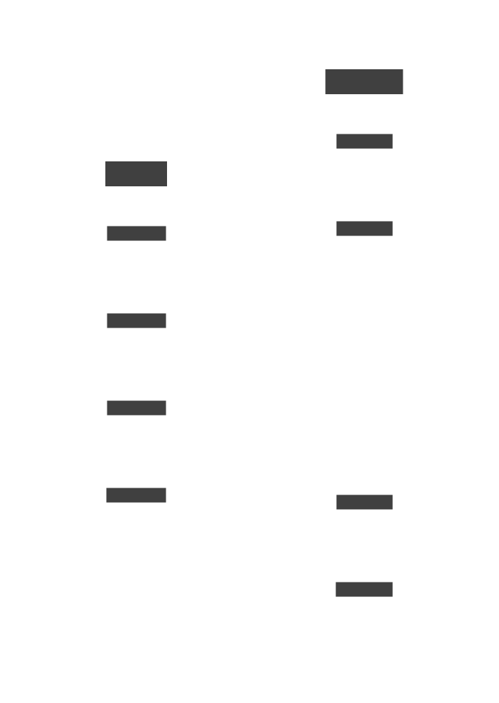
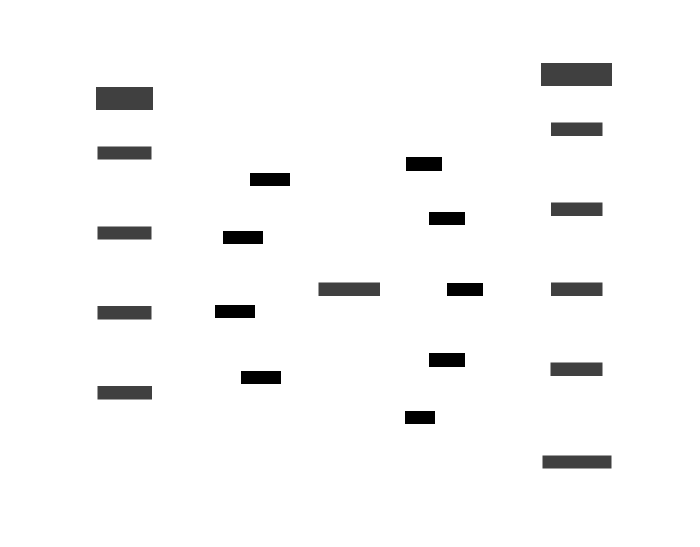

# OpenPID
## OpenPID: Peripheral Interface Documentation Standard
Our goal is to standardize how we document the communication interfaces of embedded peripherals.

| Before OpenPID | After OpenPID |
| --- | --- |
|  |  |

By creating a stable and flexible intermediate file format, peripheral manufacturers need only to export an `openpid.toml` file, which can then be used to generate code, documentation etc. accross platforms.

Engineers are more likely to choose sensors that are easier to integrate with. Fragmentation in languages used (C, C++, Rust, even Python) and environments (FreeRTOS, mbed etc.) make it infeasable to write drivers for every platform by-hand. High-quality codegen enables first-class integrations across even esoteric platforms

Benefits:
- Address more of the market by supporting more platforms
- Reduce engineering time spent writing repetitive drivers over and over accross platforms
- Once codegen exists for a platform, all users of that platform benefit from the entire set of sensors that export `openpid.toml` files, past, present, and future
- Codegen provides consistency and predictability. If codegen passes tests (TODO), it'll work for your sensor. When compared to directly writing drivers, that's a lot less code to babysit to maturity.
- Documentation and generated code will be consistent with each other. That means inconsistencies in docs are easier to iron out

## Quick-Start

## Examples

## Known Users

## License: GPL

## Priorirites:
- Stability: It's OK if we aren't able to generate fancy, high-level wrappers, if it means introducing bugs
- Underabstraction: We want this specification to apply to nearly all peripherals. For this reason, high-level abstractions that make assumptions or affect performance should be opt-in or left out altogether.
- Wide applicability: Enabled by underabstraction, and a flexibile format that covers nearly all use cases.

The big trade off is the abstraction <-> applicability scale. This project trades abstraction for applicability.

## Credits:
OpenAPI is used as a source of inspiration.
Alyron's async-stripe uses Stripe's openAPI specification and emits Rust, creating an ergonomic and nearly feature-complete SDK with

The same OpenAPI spec is used to generate documentation. Anyone can consume an OpenAPI spec and use it to generate client code in any language. 

PlatformIO has different scope, and is focused on C/C++ embedded devices. It doesn't enforce any particular compatbility for sensor libraries though, so finding sensor libararies compatible with your platform/RTOS can be difficult

## Sales Pitch & Pipe Dream
Clean, generated-code can take advantage of a programming lanugage's recent features (like async), be idiomatic to at least some baseline, and guarantee the software developer some level of predictability.
The same config, makes documentation consistent with code accross languages and platforms. If a bug is found in one platform, it will exist in the documentation, and accross all other platforms, meaning just one config file change will fix it all.

Of course, this hinges on having correct codegen. We think that this is quite achievable, since time saved from not having to hand-write drivers can be spent improving codegen. We can take great care to make codegen really good, since it's an investment that will pay us back over and over again.

If you're a hobbyist, you populating an OpenPID file based on the documentation will quickly generate the SDK you need for your platform, and any other platform you have in your kit. 

Adding support for your platform will give you immediate access to all sensors that have spec files. Adding support for your sensor will give everyone who uses a current or future supported platform easy access to your sensor.

If you're a manufacturer, you can now reduce your maintanance and documentation overheads for SDKs and get your engineers back to focusing on the underlying product, or hustled along to R&D tasks. Meanwhile, get access to a larger section of the market, knowing that your libraries will support common and even esoteric platforms, from laptops, to GUI visualizations, embedded devices running weird RToSs, and rapidly growing embedded programming languages (like Rust!). Your sensors will be selected regardless of whether your driver software is currently compatible with a client's platform, but on the merits of the sensor itself.
